# Activitat 11

## Mostrant informació de benvinguda

Modifiquem `/etc/motd` i li afegim el missatge customitzat. Aquest es mostrara unicament s'ha aconseguit fer login correctament.

## Mostrant informació: Connexions remotes
Hem de modificar `/etc/issue.net` per tal d'afegir un missatge que es mostra en intentar connectar via SSH. També hem de modificar la configuració de SSH al fitxer `/etc/ssh/sshd_config` modificant el paràmetre `Banner` per tal de mostrar aquest missatge.

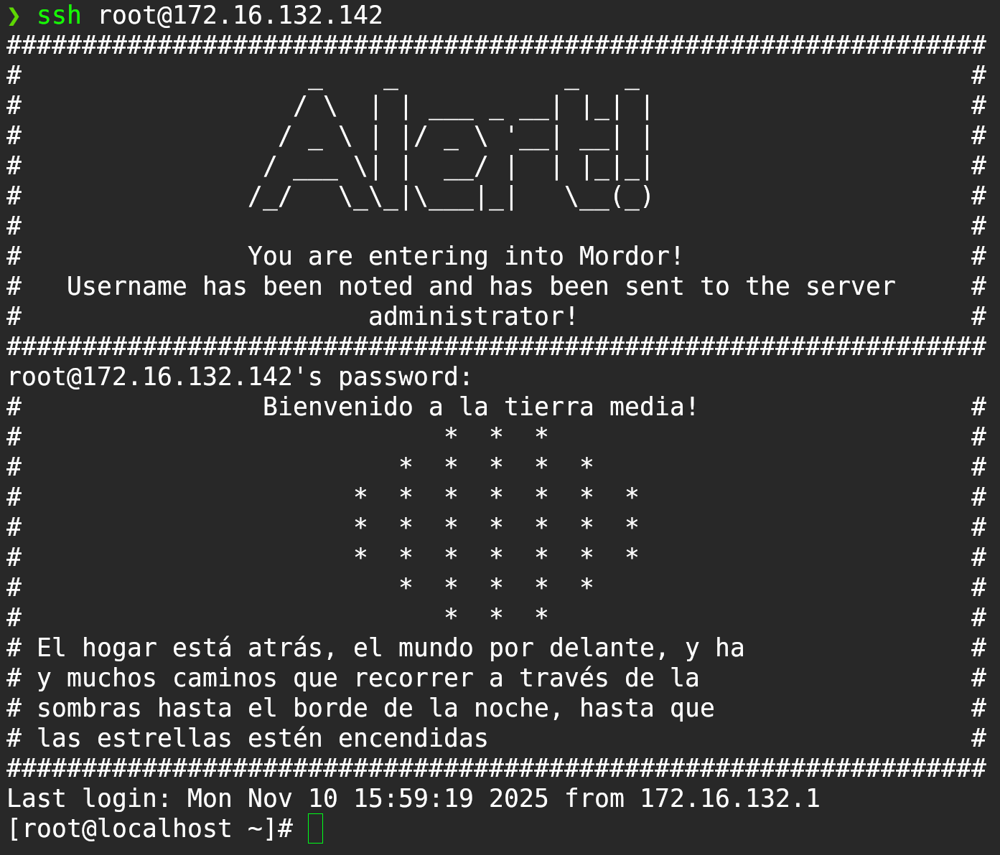

## Creació de grups

Aquest es un script en bash que simplement fa més interactiva la creació de grups.

```sh

#!/bin/bash
while true; do
    while [[ -z "$GID" ]]; do
        read -rp "GID (o 'exit' per sortir): " GID

        if [[ "$GID" == "exit" ]]; then
           	exit 0
        fi

	if ! [[ "$GID" =~ ^[0-9]+$ ]]; then
            echo "El GID ha de contindre unicament numeros."
            GID=""
        fi
    done

    read -rp "Name: " name
    groupadd -g "$GID" "$name"
    echo "Grup afegit amb GID: ${GID} i Nom: ${name}"
done
```

**Execució de l'script**

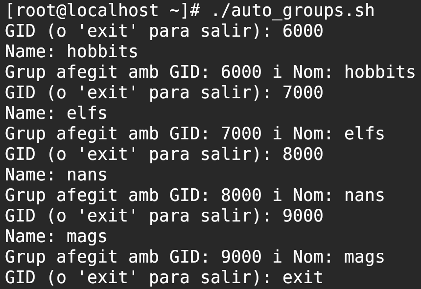

**Resultat final**

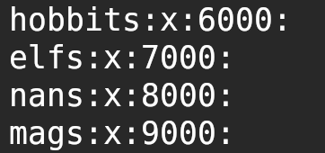

```sh
#!/bin/bash
while true; do
    while [[ -z "$USER_UID" ]]; do
        read -rp "UID (o 'exit' per sortir): " USER_UID

        if [[ "$USER_UID" == "exit" ]]; then
           	exit 0
        fi

	if ! [[ "$USER_UID" =~ ^[0-9]+$ ]]; then
            echo "El UID ha de contindre unicament numeros."
            USER_UID=""
        fi
    done


    while [[ -z "$USER_GID" ]]; do
        read -rp "GID (o 'exit' per sortir): " USER_GID

        if [[ "$USER_GID" == "exit" ]]; then
           	exit 0
        fi

	if ! [[ "$USER_GID" =~ ^[0-9]+$ ]]; then
            echo "El GID ha de contindre unicament numeros."
            USER_GID=""
        fi
    done

    read -rp "Name: " name
    useradd -u $USER_UID -g $USER_GID $name
    echo "Usuari afegit amb UID: ${USER_UID} GID: ${USER_GID} i Nom: ${name}"
    USER_UID=""
    USER_GID=""
    name=""
done
```

**Execució de l'script**

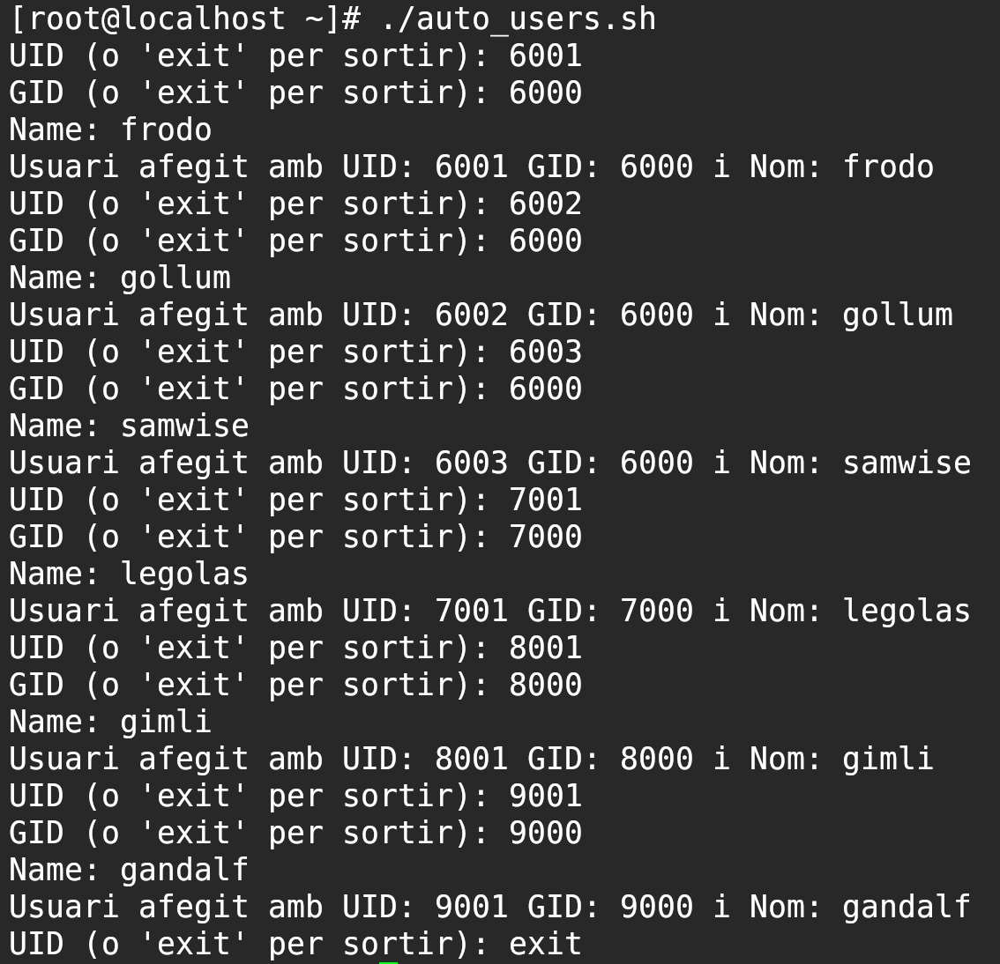

**Resultat final**

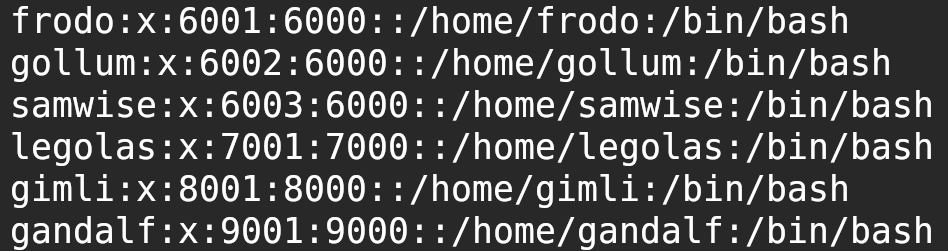

## Protegint els comptes

### Assigna la contrasenya Tolkien2LOR a tots els usuaris.

Per a canviar la contrasenya de tots els usuaris que volem d'una sola vega he executat aquestes comandes:
```sh
for u in frodo gollum samwise legolas gimli gandalf do                                     
    echo "$u:Tolkien2LOR" | sudo chpasswd
done
```

### Fer que l'usuari hagi de canviar la contrasenya en inicar sessió

Establim la data del últim canvi de contrasenya a 0 per tal de forçar a l'usuari a modificar la seva contrasenya en iniciar sessió. He executat aquestes comandes.

```sh
for u in frodo gollum samwise legolas gimli gandalf; do                                     
        sudo chage -d 0 "$u"
done
```

### Fer que el sistema bloquegi l'usuari en realitzar fallades

Primer hem de modificar del fitxer `nano /etc/security/faillock.conf` els camps que es troben a l'arxiu a `deny = 3` i `unlock_time = 120` per tal d'establir com i quan serà el bloqueig de l'usuari. A més, hem d’executar la comanda `authselect select sssd --force` per tal de configurar el sistema perquè utilitzi el perfil SSSD i actualitzi els fitxers PAM corresponents. Seguidament he executat `authselect enable-feature with-faillock` per habilitar el bloqueig per fallades i `authselect apply-changes` per aplicar tots els canvis establerts. Finalment, he modificat al fitxer `/etc/ssh/sshd_config` he modificat l'apartat que permet l'ús de PAM a SSH amb l'atribut `UsePam=yes`.

### Configurar polítiques de contrasenyes fortes

He modificat el fitxer `/etc/security/pwquality.conf` i afegit els següents camps per tal d'aplicar les restriccions demanades:
- `minlen = 12` Per establir el mínim de longitud de la contrasenya a 12 caràcters.
- `minclass = 4` Per forçar que es faci ús de majúscules, minúscules, números i caràcters especials.

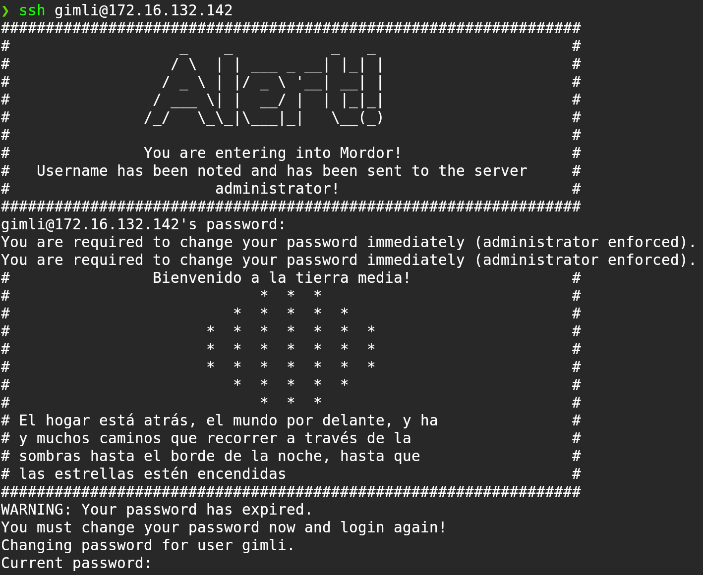

## Accés a la comarca (SSH)

Al final del fitxer `/etc/ssh/sshd_config` he hagut d'afegir els següents camps:

```
PermitRootLogin no

AllowUsers frodo samwise legolas gimli gandalf

Match User frodo,samwise,legolas,gimli
       	PasswordAuthentication yes

Match User gandalf
       	AuthenticationMethods publickey
``` 

- `PermitRootLogin no` Per tal d'evitar que es pugi accedir a root.
- `AllowUsers frodo samwise legolas gimli gandalf` Permet que iniciïn sessió amb SSH aquests usuaris i la resta queden exclosos (per tant gollum ja queda exclós).
- `Match User frodo,samwise,legolas,gimli` Tots aquests usuaris tenen unes configuracions personalitzades, que en aquest cas és que pugui iniciar sessió amb contrasenya.
- `Match User gandalf` Aplica configuracions especifiques a Gandalf i en aquest cas permetent iniciar sessió amb una clau SSH.

**Gollum no pot accedir**

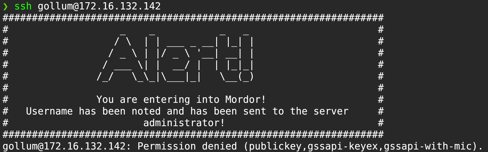

Per a configurar l'SSH de Gandalf hem hagut de realitzar tot aquest procediment:

```sh
sudo -u gandalf mkdir -p /home/gandalf/.ssh # Creem el directori .ssh

# Assignem tots els permisos necessaris per a que siguin de la seva propietat.
sudo chown gandalf /home/gandalf/.ssh
sudo chmod 700 /home/gandalf/.ssh

# Generem la clau SSH i l'afegim als seus authorized_keys.
sudo -u gandalf ssh-keygen -t ed25519 -a 100 -f /home/gandalf/.ssh/Gandalf -C "Gandalf"
sudo -u gandalf sh -c 'cat /home/gandalf/.ssh/Gandalf.pub >> /home/gandalf/.ssh/authorized_keys'

# Assignem tots els permisos necessaris per a que tots els fitxers genereats siguin de la seva propietat.
sudo chown gandalf /home/gandalf/.ssh/authorized_keys
sudo chmod 600 /home/gandalf/.ssh/authorized_keys
sudo chmod 600 /home/gandalf/.ssh/Gandalf
sudo chmod 644 /home/gandalf/.ssh/Gandalf.pub
```

## Gandalf, el mag

Per a que Gandalf sigui root he d'afegir-li també el grup `wheel` amb la següent comanda:

```sh
sudo usermod -aG wheel gandalf
```

Amb aquesta assignació ja seria capaç de realitzar accions de sudo pero per assegurar-nos que es root l'hem d'afegir al final del fitxer de sudoers per tal de que tingui permís explicit de sudo. El format és aquest:

```sh
gandalf ALL=(ALL) ALL
```

## Actualitzant Usuaris

### Canviar /home de gollum
Per a canviar el home de gollum he realitzat les següents comandes:

```sh
mkdir -p /home/smeagol # Creem el nou directori home.
chown -R gollum /home/smeagol # Fem gollum propietari.
rsync -aXS --remove-source-files /home/gollum/ /home/smeagol/ # Copiem tots els fitxers que est trobaven a origen.
usermod -d /home/smeagol gollum # Canviem el directori home a smeagol.
rmdir rmdir /home/gollum # Esborrem el /home original.
```

**Resultat final en executar totes les comandes**

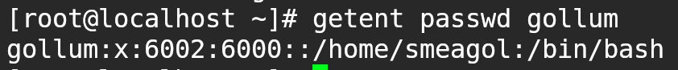

### Canviar la shell de legolas

Per a canviar la shell que usa l'usuari legolas a `/bin/tcsh` unicament hem hagut d'executar la comanda `usermod -s /bin/tcsh legolas`.

**Resultat final en executar la comanda**


### Eliminar la contrasenya de gimli

Per a esborrar la contrasenya de l'usuari gimli unicament hem hagut d'executar la comanda `sudo passwd -d gimli`.

**Resultat final en executar la comanda**

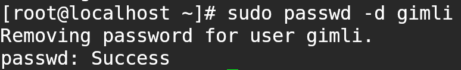

## El poder de l’anell

```sh
groupadd portadors # Creem el grup portadors.
mkdir -p /anell/bin
chown -R frodo:portadors /anell # Establim els permisos del directori.
chmod -R u=rwx,g=r /anell # Només pot executar Frodo i la resta de portadors llegir.
echo 'export PATH="/anell/bin:$PATH"' | sudo tee -a /home/frodo/.bash_profile >/dev/null # Afegim al path de Frodo
```

**Resultat final en executar totes les comandes**

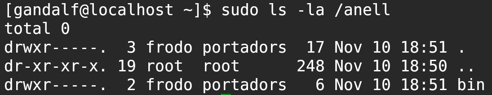

## Final del viatge

### Deshabilitar missatges a Gimli

Modifiquem `/etc/ssh/sshd_config` i afegim una restricció unicament a gimli on possi: `Banner none` per tal de no mostrar l'avís de connexió SSH. A més també creem un fitxer buit que es diu `.hushlogin` per tal de que no es mostri el MOTD per defecte en fer login.

**Resultat final**

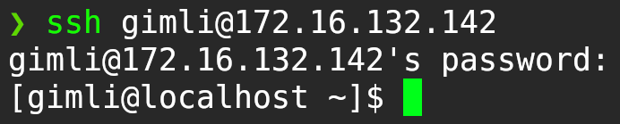

### No permetre que Gimli executi programes des del seu /home

Executem `setfacl -m d:u:gimli:rw- /home/gimli` per estableix una ACL predeterminada en `/home/gimli` perquè tot el nou dins herèti permisos d'usuari “gimli” només de lectura i escriptura, sense execució.

### Eliminar de l'univers a Samwise

Executem `sudo userdel -r samwise` per tal d'esborrar tant l'usuari com el seu home i mail spool.

## Notificació de la comarca

