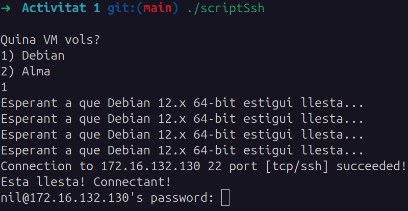

# Activitat 1

Aquest script automatitza el treball amb les maquines virtuals que utilitzarem durant el curs.

## Funcionament

1. Executa el script des de la terminal.
2. Tria la VM.
3. Espera fins que es connecti via SSH automàticament.

## Requisits

- Sistema operatiu Linux
- Modificar tant el nom de les VM com el directori on es troben.
  - **Nota**: La carpeta s'ha de dir exactament com l'arxiu vmx de la VM però sense l'extensió vmx.

## Ús

```bash
./scriptSsh
```

## Explicació detallada

Tot aquest codi ho he fet fent ús de les transparències de Bash que ens van proporcionar el curs passat a l'assignatura de Sistemes Operatius i també he consultat a ChatGPT per tal saber com comunicar-se en Linux amb Bash amb el programa VMWare.

## Bibliografia

- **Prompt utilitzat a ChatGPT**: Com puc obrir una màquina virtual configurada en VMWare mitjançant únicament d'una terminal Bash?

- **Informació Bash treta de**: 'SO_tema7.pdf', Shell Scripting

## Captures de pantalla


